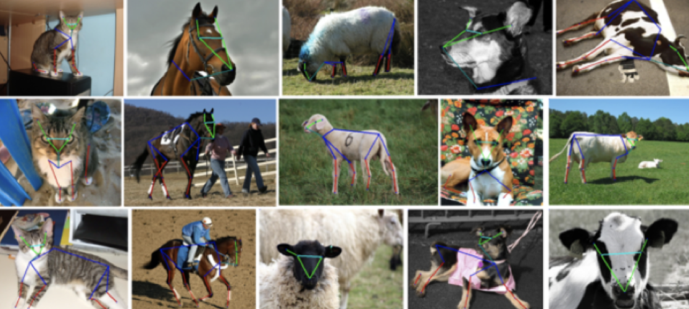

# Animal Pose dataset

This repo maintains the animal pose dataset proposed in paper [Cross-Domain Adaptation for Animal Pose Estimation](https://openaccess.thecvf.com/content_ICCV_2019/html/Cao_Cross-Domain_Adaptation_for_Animal_Pose_Estimation_ICCV_2019_paper.html) on ICCV'2019. The project page is [here](https://sites.google.com/view/animal-pose/).



### Download

The dataset splits to two subsets:

* **Part I**: includes animals (of five categories: cow, sheep, horse, cat, dog) with both bounding boxes and keypoints annotated. [[Google Drive]](https://drive.google.com/drive/folders/1xxm6ZjfsDSmv6C9JvbgiGrmHktrUjV5x?usp=sharing)
* **Part II**: includes animals of other seven species, provided for unsupervised domain adptation task. [[Google Drive]](https://drive.google.com/drive/folders/1-yOSGWts2ZDYFx29u7vPcX4CdGJkPx1w?usp=sharing)

Please contact us if you have trouble downloading the files from Google Drive.

### Format

For the **Part I** subset, the annotations follow the format convention of COCO. For each instance, it has bounding box annotation in the format *[xmin, ymin, xmax, ymax]* and the keypoint annotation in the format *[x, y, visible]*. If the *visible* flag of a keypoint is 1, it is annotated and shouble not be occluded.

For the **Part II** subset, the annotation is also included in a json file but only bounding boxes coordinates *[xmin, ymin, xmax, ymax]* are provided.

## How to Use with Hub

A simple way of using this dataset is with [Activeloop](https://activeloop.ai)'s Python package [Hub](https://github.com/activeloopai/Hub), an open-source dataset format for AI that enables you to stream machine learning datasets while training machine learning models!

First, run `pip install hub` (or `pip3 install hub`).

Then, load the dataset:

```py
import hub
ds = hub.load("hub://activeloop/animal-pose-dataset")

# The tensor layout for this dataset can be inspected using:
ds.summary()
# The dataset can be also be visualized in the Activeloop 
# Platform, or using an iframe in a jupyter notebook:
ds.visualize()
```

For more information, please check out the [Hub Documentation](https://docs.activeloop.ai)!


### Citation

If the dataset helps you, please cite our work:

> ```bibtex
> @inproceedings{cao2019cross,
>   title={Cross-domain adaptation for animal pose estimation},
>   author={Cao, Jinkun and Tang, Hongyang and Fang, Hao-Shu and Shen, Xiaoyong and Lu, Cewu and Tai, Yu-Wing},
>   booktitle={Proceedings of the IEEE/CVF International Conference on Computer Vision},
>   pages={9498--9507},
>   year={2019}
> }
> ```

